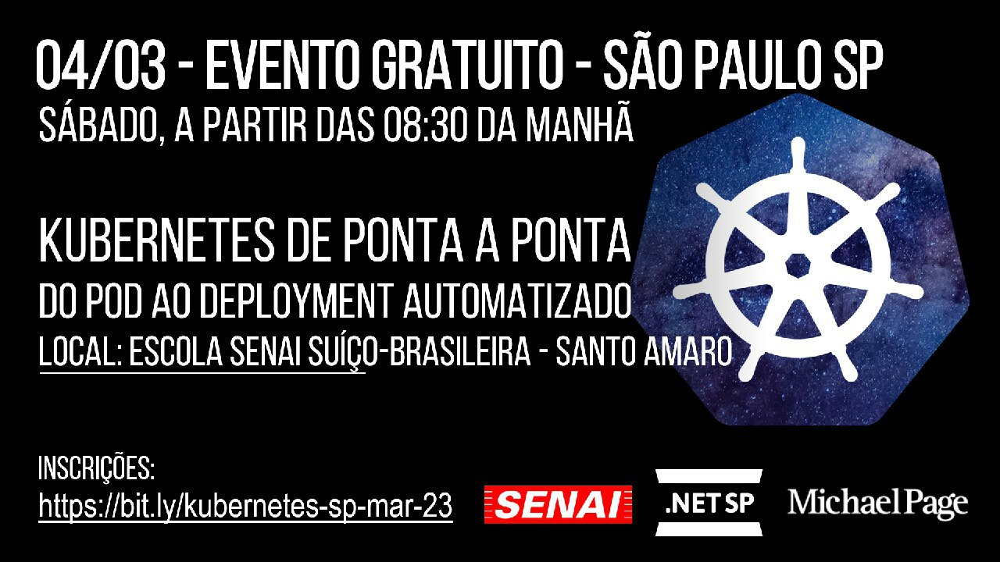
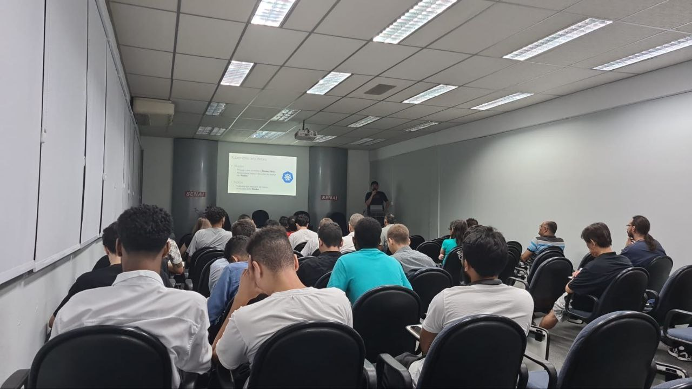
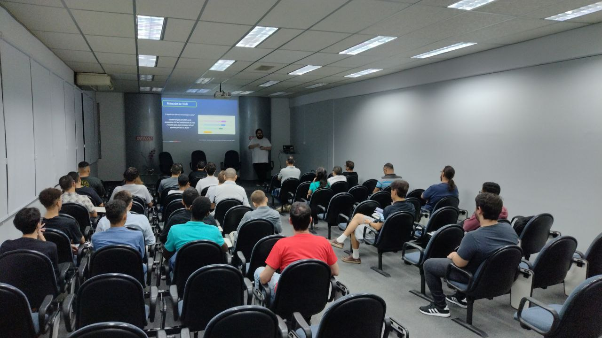

# Kubernetes-2023-03
Fotos e informações gerais sobre o **Workshop de Kubernetes** realizado em **04/03/2023** na cidade de **São Paulo-SP**.

Organizadores:
- **Renato Groffe (Microsoft MVP, MTAC)**
- **Atila Olivi (SENAI)**
- **Eduardo Hilpert (Michael Page)**

Número de participantes: **30 pessoas**

Apresentações que aconteceram durante o evento:
* Uma perspectiva de mercado para Tech - Eduardo Hilpert (Michael Page)

* Kubernetes: uma visão geral - Do Pod ao Deployment - Renato Groffe (Microsoft MVP, MTAC)

Este evento foi uma parceria entre a comunidade [**.NET SP**](https://www.meetup.com/dotnet-Sao-Paulo/), a [**Escola Senai Suíço-Brasileira Paulo Ernesto Tolle**](https://suicobrasileira.sp.senai.br/) e a [**Michael Page**](https://www.michaelpage.com.br/).

Formulário utilizado para inscrições: [**Sympla**](https://www.sympla.com.br/evento/kubernetes-de-ponta-a-ponta-do-pod-ao-deployment-automatizado-gratuito-e-presencial/1876047)

Local: Escola SENAI Suíço-Brasileira Paulo Ernesto Tolle - Rua Bento Branco de Andrade Filho, 379 - Santo Amaro - São Paulo/SP - CEP 04757-000

